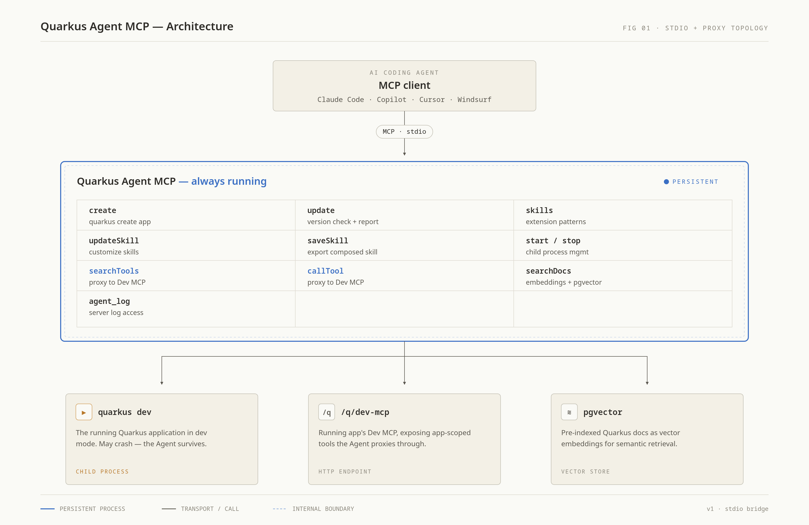

# Quarkus Agent MCP

<p align="center">
  
</p>

A standalone MCP server that enables AI coding agents to create, manage, and interact with Quarkus applications. It runs as a separate process that survives app crashes, giving agents the ability to create projects, check for updates, read extension skills, control application lifecycle, proxy Dev MCP tools, and search Quarkus documentation.

Part of the [DevStar](https://github.com/quarkusio/quarkus/discussions/53093) working group.

## Prerequisites

- Java 21+
- Docker or Podman (for documentation search)
- One of: [Quarkus CLI](https://quarkus.io/guides/cli-tooling), [Maven](https://maven.apache.org), or [JBang](https://www.jbang.dev/download/) (for creating new projects)

## Installation

### Claude Code plugin

Add the marketplace and install the plugin:

```bash
claude plugin marketplace add quarkusio/quarkus-agent-mcp
claude plugin install quarkus-agent@quarkus-tools
```

This installs the plugin and configures the MCP server automatically. Requires [JBang](https://www.jbang.dev/download/).

### Via JBang (recommended)

[JBang](https://www.jbang.dev/download/) resolves the uber-jar from Maven Central automatically — no build step needed.

#### Claude Code

```bash
claude mcp add quarkus-agent -- jbang quarkus-agent-mcp@quarkusio
```

#### VS Code / GitHub Copilot

Add to `.vscode/mcp.json` in your workspace:

```json
{
  "servers": {
    "quarkus-agent": {
      "type": "stdio",
      "command": "jbang",
      "args": ["quarkus-agent-mcp@quarkusio"]
    }
  }
}
```

#### IBM Bob

Add to `.bob/mcp.json`:

```json
{
  "mcpServers": {
    "quarkus-agent": {
      "command": "jbang",
      "args": ["quarkus-agent-mcp@quarkusio"]
    }
  }
}
```

#### Cursor

Add to `.cursor/mcp.json`:

```json
{
  "mcpServers": {
    "quarkus-agent": {
      "command": "jbang",
      "args": ["quarkus-agent-mcp@quarkusio"]
    }
  }
}
```

#### Windsurf

Add to `~/.codeium/windsurf/mcp_config.json`:

```json
{
  "mcpServers": {
    "quarkus-agent": {
      "command": "jbang",
      "args": ["quarkus-agent-mcp@quarkusio"]
    }
  }
}
```

#### JetBrains IDEs (IntelliJ IDEA, WebStorm, etc.)

In **Settings → Tools → AI Assistant → MCP Servers** (or the GitHub Copilot MCP settings), add a server with an **absolute path** to `jbang`:

```json
{
  "servers": {
    "quarkus-agent": {
      "type": "stdio",
      "command": "/home/you/.jbang/bin/jbang",
      "args": ["quarkus-agent-mcp@quarkusio"]
    }
  }
}
```

> **Why absolute paths?** JetBrains IDEs launched from the desktop inherit the **system PATH**, not your shell PATH (`~/.bashrc` / `~/.zshrc`). Tools installed via SDKMAN!, JBang's default installer, asdf, or mise are typically on the shell PATH only — so the IDE can't find them. See [Troubleshooting](#jbang-or-java-not-found-enoent) below.

Alternatively, use the direct download method with an absolute path to `java`:

```json
{
  "servers": {
    "quarkus-agent": {
      "type": "stdio",
      "command": "/path/to/java",
      "args": ["-jar", "/path/to/quarkus-agent-mcp-runner.jar"]
    }
  }
}
```

### Via direct download

Download the uber-jar from the [latest GitHub Release](https://github.com/quarkusio/quarkus-agent-mcp/releases/latest), then:

```bash
claude mcp add quarkus-agent -- java -jar /path/to/quarkus-agent-mcp-runner.jar
```

### Build from source

```bash
git clone https://github.com/quarkusio/quarkus-agent-mcp.git
cd quarkus-agent-mcp
./mvnw package -DskipTests -Dquarkus.package.jar.type=uber-jar
```

This produces the uber-jar at `target/quarkus-agent-mcp-1.0.0-SNAPSHOT-runner.jar` (version may vary).

```bash
claude mcp add quarkus-agent -- java -jar /path/to/quarkus-agent-mcp/target/quarkus-agent-mcp-1.0.7-runner.jar
```

#### Verify

After registering, ask your agent something like:

> "Search the Quarkus docs for how to create a REST endpoint"

If the MCP server is working, the agent will use `quarkus_searchDocs` and return documentation results.

## Usage

### Creating a new Quarkus app

Ask your agent to build a Quarkus application using natural language. The agent uses the MCP tools automatically.

**Example conversation:**

> **You:** Create a Quarkus REST API with a greeting endpoint and a PostgreSQL database
>
> **Agent:** _(uses `quarkus_create` to scaffold the project with `rest-jackson,jdbc-postgresql,hibernate-orm-panache` extensions — the app starts automatically in dev mode, a `CLAUDE.md` is generated with project-specific workflow instructions, and a `.mcp.json` is created for automatic MCP server discovery)_
>
> **Agent:** _(calls `quarkus_skills` to learn the correct patterns for Panache, REST, and other extensions before writing any code)_
>
> **You:** Add a `Greeting` entity and a REST endpoint that stores and retrieves greetings
>
> **Agent:** _(writes the code following patterns from skills, then runs tests using `quarkus_callTool` — via a subagent if supported)_

### Development workflow

The MCP server guides the agent through the optimal Quarkus development workflow:

```
NEW PROJECT                           EXISTING PROJECT

1. quarkus_create                     1. quarkus_update
   → scaffolds + auto-starts             → checks version, suggests upgrades
   → generates CLAUDE.md + .mcp.json
                                      2. quarkus_start
2. quarkus_skills                        → starts dev mode
   → learn extension patterns
                                      3. quarkus_skills
3. quarkus_searchDocs                    → learn extension patterns
   → look up APIs, config
                                      4. quarkus_searchDocs
4. Write code + tests                    → look up APIs, config

5. Run tests                          5. Write code + tests
   → quarkus_callTool
   → devui-testing_runTests           6. Run tests
                                         → quarkus_callTool
6. Iterate                               → devui-testing_runTests
```

**Key points:**

- **Hot reload** is automatic in Quarkus dev mode — triggered on the next access (HTTP request or test run), not on file save.
- **Skills before code** — the agent reads extension-specific skills to learn correct patterns, testing approaches, and common pitfalls before writing any code.
- **Tests via subagents** — if your agent supports subagents, test execution can be dispatched to one so the main conversation stays responsive.
- **The MCP server survives crashes** — if the app crashes due to a code error, the agent can use `devui-exceptions_getLastException` to get structured exception details (class, message, stack trace, user code location) and fix it. Use `quarkus_logs` for broader context.
- **CLAUDE.md** — every new project gets a `CLAUDE.md` with Quarkus-specific workflow instructions that guide the agent.
- **`.mcp.json`** — every new project gets a `.mcp.json` for automatic MCP server discovery by agents that support the convention (Claude Code, Pi/pi.dev).

### What the agent can do with a running app

Once a Quarkus app is running in dev mode, the agent can discover and use all Dev MCP tools via `quarkus_searchTools` and `quarkus_callTool`. The tool list is **dynamic** — it changes when extensions are added or removed, so the agent should re-discover tools after any extension change. Typical tools include:

| Capability | How to discover | Example |
|-----------|----------------|---------|
| Testing | `quarkus_searchTools` query: `test` | Run all tests, run a specific test class |
| Configuration | `quarkus_searchTools` query: `config` | View and change config properties |
| Extensions | `quarkus_searchTools` query: `extension` | Add or remove extensions at runtime |
| Endpoints | `quarkus_searchTools` query: `endpoint` | List all REST endpoints and their URLs |
| Dev Services | `quarkus_searchTools` query: `dev-services` | View database URLs, container info |
| Log levels | `quarkus_searchTools` query: `log` | Change log levels at runtime |
| Exceptions | `devui-exceptions_getLastException` | Get last compilation/deployment/runtime exception with stack trace and source location |

### Extension skills

The agent can read extension-specific coding skills using `quarkus_skills`. Skills contain patterns, testing guidelines, and common pitfalls for each extension — things like "always use `@Transactional` for write operations with Panache" or "don't create REST clients manually, let CDI inject them."

When called without a query, skills are organized by category (Web, Data, Security, Core, etc.) for easier discovery.

Skills are loaded using a three-layer chain (most specific wins):

1. **Extension skills** — discovered from individual extension deployment JARs (`META-INF/quarkus-skill.md`) in the local Maven repository, composed with extension metadata and available Dev MCP tools. This supports skills from Quarkus core, Quarkiverse, and custom extensions. For older Quarkus versions that don't ship skill files in deployment JARs, the aggregated `quarkus-extension-skills` JAR is used as a fallback.
2. **User-level skills** — from `~/.quarkus/skills/<extension-name>/SKILL.md` (or a directory configured via `agent-mcp.local-skills-dir`). Useful for extension developers testing new or modified skills without rebuilding the aggregated JAR.
3. **Project-level skills** — from `.agent/skills/<extension-name>/SKILL.md` in the project directory. Allows teams to customize extension patterns for their specific project conventions.

Each layer can either **enhance** (default) or **override** the previous layer, controlled by the `mode` field in the SKILL.md frontmatter:

- **`mode: enhance`** (default) — appends content to the base skill. The base content is preserved and the customization is added after a separator. This is ideal for adding project conventions or team standards without losing the built-in guidance.
- **`mode: override`** — fully replaces the base skill. Use this when you need complete control over a skill's content.

The agent can also create or update skill customizations using `quarkus_updateSkill`. When the user asks to customize a skill, the agent will ask:
1. **Enhance or override?** — append to the base skill or fully replace it.
2. **Project or global scope?** — save under `.agent/skills/` (this project only) or `~/.quarkus/skills/` (all projects).

To inspect or version-control a skill, the agent can use `quarkus_saveSkill` to materialize the full composed skill (all layers merged) as a local file in `.agent/skills/`.

### Documentation search

The agent can search Quarkus documentation at any time using `quarkus_searchDocs`. This uses semantic search (BGE embeddings + pgvector) over the full Quarkus documentation.

On first use, a Docker/Podman container with the pre-indexed documentation is started automatically. If a project directory is provided, the documentation version matches the project's Quarkus version.

### Update checking

For existing projects, `quarkus_update` checks if the Quarkus version is current and provides a full upgrade report:

- Compares build files against [reference projects](https://github.com/quarkusio/code-with-quarkus-compare)
- Runs `quarkus update --dry-run` (if CLI available) to preview automated migrations
- Links to the structural diff between versions
- Recommends manual actions for changes that automated migration doesn't cover

## MCP Tools Reference

### App Creation

| Tool | Description | Parameters |
|------|-------------|------------|
| `quarkus_create` | Create a new Quarkus app, auto-start in dev mode, generate CLAUDE.md and `.mcp.json` | `outputDir` (required), `groupId`, `artifactId`, `extensions`, `buildTool`, `quarkusVersion`, `noCode`, `noWrapper`, `createInCurrentDir` |

### Update Checking

| Tool | Description | Parameters |
|------|-------------|------------|
| `quarkus_update` | Check if project is up-to-date, provide upgrade report | `projectDir` (required) |

### Extension Skills

| Tool | Description | Parameters |
|------|-------------|------------|
| `quarkus_skills` | Get coding patterns, testing guidelines, and pitfalls for project extensions | `projectDir` (required), `query` |
| `quarkus_updateSkill` | Create or update a skill customization (enhance or override) | `projectDir` (required), `skillName` (required), `content` (required), `description`, `categories`, `mode`, `scope` |
| `quarkus_saveSkill` | Save a composed skill as a local file in `.agent/skills/` for inspection and version control | `projectDir` (required), `skillName` (required) |

### Lifecycle Management

| Tool | Description | Parameters |
|------|-------------|------------|
| `quarkus_start` | Start a Quarkus app in dev mode | `projectDir` (required), `buildTool` |
| `quarkus_stop` | Graceful shutdown | `projectDir` (required) |
| `quarkus_restart` | Force restart (usually not needed — hot reload is automatic) | `projectDir` (required) |
| `quarkus_status` | Get app state | `projectDir` (required) |
| `quarkus_logs` | Get recent log output | `projectDir` (required), `lines` |
| `quarkus_list` | List all managed instances | _(none)_ |

### Dev MCP Proxy

| Tool | Description | Parameters |
|------|-------------|------------|
| `quarkus_searchTools` | Discover tools on the running app's Dev MCP server | `projectDir` (required), `query` |
| `quarkus_callTool` | Invoke a Dev MCP tool by name | `projectDir` (required), `toolName` (required), `toolArguments` |

### Documentation Search

| Tool | Description | Parameters |
|------|-------------|------------|
| `quarkus_searchDocs` | Semantic search over Quarkus documentation | `query` (required), `maxResults`, `projectDir` |

### Agent Logging

In stdio mode, server logs are invisible because stdout/stderr are consumed by the MCP protocol.

File logging can be enabled permanently by setting `agent-mcp.log.enabled=true`. The easiest way is via an environment variable in your MCP server configuration:

**Claude Code:**

```bash
claude mcp add quarkus-agent -e AGENT_MCP_LOG_ENABLED=true -- jbang quarkus-agent-mcp@quarkusio
```

**VS Code / Cursor / Windsurf / JetBrains (JSON config):**

```json
{
  "servers": {
    "quarkus-agent": {
      "type": "stdio",
      "command": "jbang",
      "args": ["quarkus-agent-mcp@quarkusio"],
      "env": {
        "AGENT_MCP_LOG_ENABLED": "true"
      }
    }
  }
}
```

Logs are written to `~/.quarkus/agent-mcp/agent-mcp.log`.

The agent can also toggle file logging on-the-fly using these tools:

| Tool | Description | Parameters |
|------|-------------|------------|
| `quarkus_agent_log_enable` | Enable file logging to `~/.quarkus/agent-mcp/agent-mcp.log` | _(none)_ |
| `quarkus_agent_log_disable` | Disable file logging (the log file is preserved) | _(none)_ |
| `quarkus_agent_log` | Read the last N lines from the log file | `lines` |

## Architecture

<p align="center">
  
</p>

The MCP server wraps `quarkus dev` as a child process, so it stays alive when the app crashes. This is the key differentiator from the built-in Dev MCP server.

## Configuration

Configuration via `application.properties`, system properties (`-D`), or environment variables:

| Property | Default | Description |
|----------|---------|-------------|
| `agent-mcp.doc-search.image-prefix` | `ghcr.io/quarkusio/chappie-ingestion-quarkus` | Docker image prefix for pre-indexed docs |
| `agent-mcp.doc-search.image-tag` | `latest` | Default image tag (overridden by detected Quarkus version) |
| `agent-mcp.doc-search.pg-user` | `quarkus` | PostgreSQL user |
| `agent-mcp.doc-search.pg-password` | `quarkus` | PostgreSQL password |
| `agent-mcp.doc-search.pg-database` | `quarkus` | PostgreSQL database |
| `agent-mcp.doc-search.min-score` | `0.82` | Minimum similarity score for search results |
| `agent-mcp.local-skills-dir` | `~/.quarkus/skills` | Directory for user-level skill customizations |
| `agent-mcp.process.mvn-cmd` | _(auto-detect)_ | Override the Maven command used to start dev mode (e.g. `mvn` to skip wrapper detection) |
| `agent-mcp.process.gradle-cmd` | _(auto-detect)_ | Override the Gradle command used to start dev mode (e.g. `gradle` to skip wrapper detection) |
| `agent-mcp.log.enabled` | `false` | Enable file logging on startup — logs are written to `~/.quarkus/agent-mcp/agent-mcp.log` |

## Building a Native Image

For instant startup (no JVM warmup):

```bash
./mvnw package -Dnative -DskipTests -Dquarkus.package.jar.type=uber-jar
```

Then reference the native binary in your MCP config:

```bash
claude mcp add quarkus-agent -- ./target/quarkus-agent-mcp-*-runner
```

## Presentation

An HTML slide deck is available in the `presentation/` directory for team demos and talks.

```bash
# Open directly in a browser
xdg-open presentation/index.html   # Linux
open presentation/index.html        # macOS
```

Press **F** for fullscreen, arrow keys or space to navigate slides.

## Troubleshooting

### `jbang` or `java` not found (ENOENT)

```
Error: spawn jbang ENOENT
```

This happens when the MCP client (IDE, desktop app) cannot find `jbang` or `java` on its PATH. It affects **JetBrains IDEs**, **Claude Desktop**, and other desktop applications that don't inherit your shell environment.

**Why it happens:** Desktop applications launched from a graphical environment inherit the **system PATH** (from `systemd` on Linux, or system environment variables on Windows/macOS), not the **shell PATH** (from `~/.bashrc`, `~/.zshrc`, `~/.profile`). Tools installed via user-local version managers — SDKMAN!, JBang's default installer, asdf, mise — are on the shell PATH but not the system PATH.

This is different from VS Code, which typically resolves the full shell environment, and from IDE built-in terminals, which start a proper login shell.

**Solutions (pick one):**

1. **Use absolute paths** in your MCP config (recommended):
   ```json
   {
     "command": "/home/you/.jbang/bin/jbang",
     "args": ["quarkus-agent-mcp@quarkusio"]
   }
   ```
   Find the path with `which jbang` or `which java` in a terminal.

2. **Symlink into a system PATH directory:**
   ```bash
   sudo ln -s ~/.jbang/bin/jbang /usr/local/bin/jbang
   ```

3. **Add to the system PATH permanently:**
   - **Linux (systemd):** Create `/etc/profile.d/jbang.sh` with `export PATH="$HOME/.jbang/bin:$PATH"`, or add the path to `~/.config/environment.d/` for systemd user sessions.
   - **macOS:** Use `launchctl setenv PATH ...` or add to `/etc/paths.d/`.
   - **Windows:** Add `%USERPROFILE%\.jbang\bin` to the system environment variables (System → Advanced → Environment Variables → System variables → Path).

### `AccessDeniedException: C:\WINDOWS\system32\config` (Windows)

```
java.nio.file.AccessDeniedException: C:\WINDOWS\system32\config
```

This is a [Quarkus core issue](https://github.com/quarkusio/quarkus/issues/53739) that occurs on Windows when the MCP server is launched by an IDE with the working directory set to `system32`. Quarkus scans `{working-dir}/config` for configuration files and hits the protected Windows registry hive directory.

**Workaround:** Set the working directory explicitly in your MCP config, or pass `-Duser.dir` to override it:

```json
{
  "servers": {
    "quarkus-agent": {
      "type": "stdio",
      "command": "java",
      "args": ["-Duser.dir=C:\\Users\\you", "-jar", "C:\\path\\to\\quarkus-agent-mcp-runner.jar"]
    }
  }
}
```

## Related Projects

- [Quarkus Dev MCP](https://github.com/quarkusio/quarkus) — Built-in MCP server inside running Quarkus apps
- [quarkus-skills](https://github.com/quarkusio/quarkus-skills) — Standalone skill files for Quarkus (Agent Skills specification)
- [code-with-quarkus-compare](https://github.com/quarkusio/code-with-quarkus-compare) — Reference projects for build file comparison
- [chappie-docling-rag](https://github.com/chappie-bot/chappie-docling-rag) — Builds the pgvector Docker images with pre-indexed Quarkus docs
- [quarkus-mcp-server](https://github.com/quarkiverse/quarkus-mcp-server) — Quarkiverse MCP Server extension used by this project

## Privacy Policy

Quarkus Agent MCP runs entirely on your local machine. It does **not** collect, transmit, or store any personal data, telemetry, or analytics.

The server makes the following outbound network requests, all in service of its documented features:

| Request | Destination | Purpose |
|---------|-------------|---------|
| Skills JAR download | `repo1.maven.org` (or your configured Maven mirror) | Download extension-specific coding patterns for your project's Quarkus version |
| Version check | `github.com/quarkusio/code-with-quarkus-compare` | Determine the latest Quarkus version and fetch reference build files for update comparison |
| Documentation container | `ghcr.io/quarkusio/chappie-ingestion-quarkus` | Pull a Docker image with pre-indexed Quarkus documentation for local semantic search |
| Dev MCP proxy | `localhost` only | Communicate with your running Quarkus application's Dev MCP server |

No data is sent to Quarkus, Red Hat, or any third party. All downloaded artifacts are cached locally in standard locations (`~/.m2/repository`, Docker image cache). Source code and project files never leave your machine.

## License

Apache License 2.0
